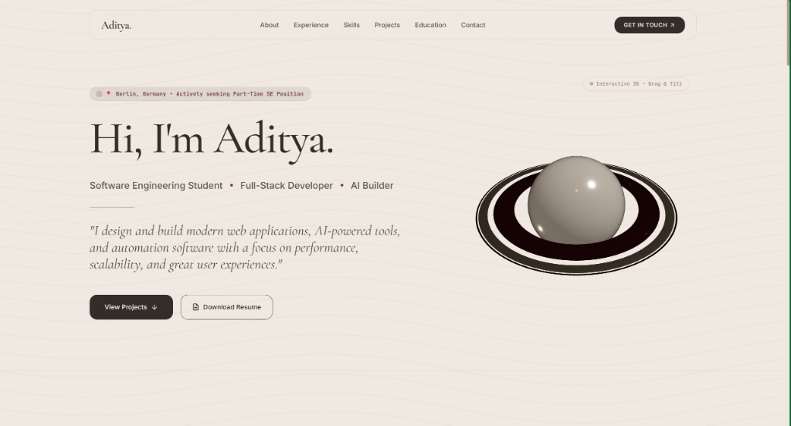

# Aditya — Software Engineer & AI Portfolio

[](https://nextjs.org/)
[](https://www.typescriptlang.org/)
[](https://tailwindcss.com/)
[](https://vercel.com/)

A modern, high-performance, responsive developer portfolio showcasing my work as a **Software Engineer | AI & Full-Stack Developer** based in Berlin, Germany.



---

## 🌟 Overview & Key Features

- **Modern & Premium UI/UX:** Engineered using Next.js 14 App Router, TypeScript, Tailwind CSS, and Framer Motion for smooth micro-animations.
- **Full-Stack & AI Showcase:** Highlights my experience co-founding **SimpleGerman** alongside production AI and automation projects (Selenium Chatbots, Machine Learning Habit Trackers, Chrome Dwell Time Extensions).
- **Resume Integration:** Integrated production-grade, ATS-optimized 1-page LaTeX resume (`resume.tex`).
- **SEO & Performance Optimized:** Semantic HTML5, dynamic page meta-tags, and optimized component hydration for fast load times.

---

## 🛠️ Tech Stack

- **Core Framework:** [Next.js 14](https://nextjs.org/) (App Router)
- **Language:** [TypeScript](https://www.typescriptlang.org/)
- **Styling:** [Tailwind CSS](https://tailwindcss.com/)
- **Animations:** [Framer Motion](https://www.framer.com/motion/)
- **Icons:** [Lucide React](https://lucide.dev/)
- **Resume Engine:** Production LaTeX (`pdflatex` / Overleaf ATS template)

---

## 🚀 Getting Started

### Prerequisites

- Node.js `v18.x` or higher
- npm / yarn / pnpm

### Installation

1. **Clone the repository:**
   ```bash
   git clone https://github.com/Aadi-code186/portfolio.git
   cd portfolio
   ```

2. **Install dependencies:**
   ```bash
   npm install
   ```

3. **Run the local development server:**
   ```bash
   npm run dev
   ```

4. **Open in browser:**
   Navigate to [http://localhost:3000](http://localhost:3000).

---

## 📄 License & Copyright

Copyright (c) 2026 Aditya Parashar. All rights reserved.

No part of this repository may be copied, modified, distributed, or used in any form without the express written permission of the copyright holder. See [`LICENSE`](./LICENSE) for details.
